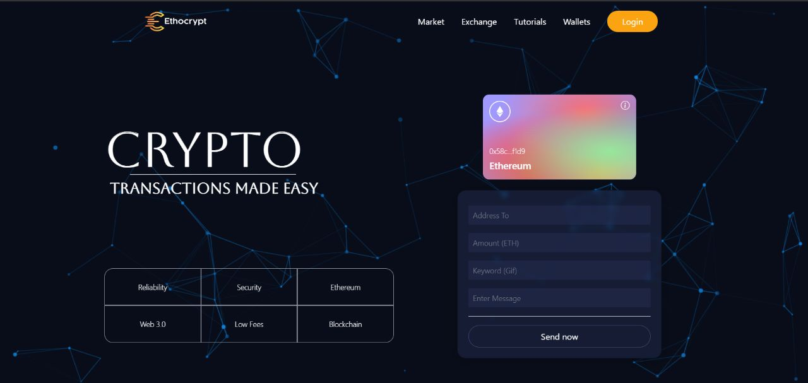

<h1 align = "center">
Ethocrypt - Web 3.0 Blockchain Application
</h1>

<b> Ethocrypt </b> is a Web3 implementing react application. It send transactions though Blockchain and one can see all the transactions on the dashboard.

We are using a decentralized blockchain platform that establishes a peer-to-peer network that securely executes and verifies application code, called smart contracts.

## Why Ethocrypt

Unlike other crypto transaction wallets, Ethocrypt uniquely does the transaction. When we do a transaction a gif or a meme will also be stored as pair in the blockchain with the address of the sender or receiver. This gif or meme will be visible on the dashboard along with other information. This makes it look unique.

## How to run?
Write following command on terminal:  
`nmp run dev`

## Prerequisites
1. You need to have some ethereum amount in your wallet.
2. Set-up the MetaMask Account and download its extension.
